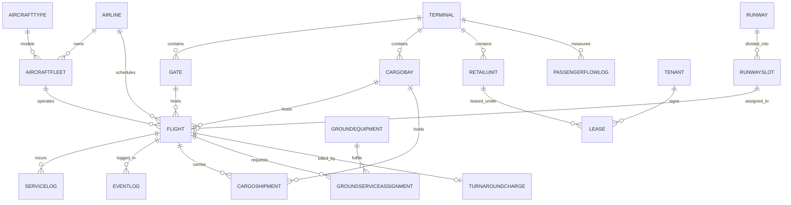

# AeroVertex — v2
## Airport Ground Operations Management System — Complete Project Blueprint

*A DBMS course project: a highly-normalized MySQL database whose data drives a
live, accelerated, top-down simulation of an airport. A 30-minute compressed
"day" plays out on an interactive SVG map; clicking anything on the map reads the
matching rows live from the database.*

---

## Table of Contents

1. What We Are Building
2. The Simulation Model — How the 30-Minute Demo Works
3. The Architecture — How Front-End, API, and Database Connect
4. Technology Stack
5. Design Decisions — Locked
6. Project Scope — In and Out
7. The Conceptual Model — All Entities and Attributes
8. Relationships and Cardinalities
9. The ER Diagram
10. Normalization — From a Messy Table to BCNF
11. The Relational Schema — Table by Table
12. The Flight State Machine
13. The SQL Layer — Triggers, Functions, Procedures, Queries, Views
14. The Interactive Map and Front-End Architecture
15. The Click Targets — What Each Panel Shows
16. The Simulation Timeline and Seed Data
17. Work Distribution for a Three-Person Team
18. Build Timeline — Phase by Phase
19. The Demo Script
20. Risks and How We Handle Them
21. How This Maps to the Grading Rubric
22. Glossary — Plain-English Definitions

---

## 1. What We Are Building

AeroVertex is a database-driven management system for a medium-sized regional
airport with **one passenger terminal** and **one cargo terminal**, two runways,
gates, cargo bays, a control tower, and a small fleet of ground-service vehicles.

The defining idea: **the database is the website.** The home page is a stylized
top-down SVG map of the airport. Every aircraft, gate, and cargo bay drawn on it
is placed and coloured from data read live from a MySQL database.

On top of that, AeroVertex runs as an **accelerated simulation**. When the site
loads, a simulation clock starts and compresses a full airport day into about
**30 minutes**. Planes land every few seconds, taxi to their terminals, are
serviced, and depart — all visibly, in fast-forward. The user can click any plane
to see its details, click the airport's control tower to see air-traffic
sequencing, click the cargo terminal to see cargo handling, and so on. Every one
of those clicks runs a real query against the database.

The single hard technical idea the project is built around is **time-bounded
resource allocation with conflict detection**: an airport has few scarce
resources (gates, runway slots, cargo bays, fuel trucks) and many flights
competing for them across time, and no two flights may hold the same resource in
overlapping windows. The triggers, the procedures, and the delay-cascade engine
all grow out of that one problem.

---

## 2. The Simulation Model — How the 30-Minute Demo Works

This is the core concept of v2, so it is explained carefully.

### The principle: pre-compute, then play back

The simulation is **not** a live background process. The entire 30-minute
timeline is generated and stored in the database **before** the demo runs.
Nothing about the timeline changes while the simulation plays — the database
already holds every event of the simulated day. The front-end simply *plays it
back* at high speed.

This is the right design for three concrete reasons:

- **It fits the hosting.** The site is hosted on Vercel, whose serverless
  functions are stateless — they answer one request and shut down, and cannot run
  a background loop ticking a clock. A pre-computed timeline means the server only
  ever does simple reads, which is exactly what serverless functions do well.
- **It cannot break mid-demo.** Because nothing is being changed while the
  simulation plays, there is no race condition, no half-updated state, no API
  call that fails at the wrong moment.
- **It is still a real DBMS demonstration.** Every plane position, every status,
  every cargo item shown is produced by a genuine SQL query against the tables.
  The plane moves because a `SELECT` driven by the simulation clock says where it
  should be. Clicking it runs a real join. The simulation is a *visualization of
  the database*, not a substitute for it.

### Simulation time

The simulation runs on its own clock measured in **simulation seconds**, from
`0` to `1800` (30 real minutes = one compressed airport day). Every flight
carries four simulation-time columns:

- `sim_arrival_sec` — when the aircraft touches down
- `sim_gate_in_sec` — when it reaches its gate or cargo bay
- `sim_gate_out_sec` — when it pushes back
- `sim_departure_sec` — when it lifts off

The front-end keeps a single counter, `currentSimSecond`, that advances in real
time. At any moment it asks the database (through the API): *"which flights are
active at simulation-second N, and what are their positions?"* A plane's icon
position is a **function of the simulation clock** — the front-end interpolates
the icon along the runway → taxiway → gate path between that flight's
`sim_arrival_sec` and `sim_gate_in_sec`, and later back out between
`sim_gate_out_sec` and `sim_departure_sec`. No GPS, no real-time feed — just
arithmetic on stored numbers.

The flight's `status` column is likewise derived from where `currentSimSecond`
falls relative to those four numbers (before arrival = `Inbound`, between arrival
and gate-in = `Taxiing`, and so on), so the icon's colour and the status panels
all stay consistent with the clock.

### Where triggers and procedures genuinely fire

"Pre-computed" does not mean "no writes ever." The database logic is exercised in
two real, demonstrable places:

1. **At seed time.** When the timeline is generated and every flight row is
   `INSERT`ed, the gate-buffer trigger and the gate-compatibility trigger fire on
   each insert. This is where they prove they work, and where deliberately-seeded
   bad rows are caught and rejected.
2. **During the demo, on user actions.** The interactive buttons —
   "Assign Ground Equipment," "Generate Turnaround Summary," and "Delay this
   Flight" — run live procedures against the database in real time when clicked.
   So the triggers and procedures are demonstrably live; they are driven by the
   presenter's clicks rather than by a background loop.

This gives the best of both worlds: a smooth, unbreakable simulation **and**
real, live SQL execution on demand.

---

## 3. The Architecture — How Front-End, API, and Database Connect

Three layers, all deployable:

```
  [ React front-end on Vercel ]
        |  HTTPS requests ("what is the state at sim-second N?")
        v
  [ Thin API — serverless functions on Vercel ]
        |  SQL queries / CALL procedure
        v
  [ MySQL database — managed host (PlanetScale / Railway / Aiven) ]
```

- **The front-end** holds the simulation clock, draws the SVG map, and handles
  clicks. It never talks to MySQL directly — it calls the API.
- **The API** is a small set of stateless serverless functions on Vercel. Each
  one receives a request, runs one SQL query (or one `CALL`), and returns JSON.
  It is the only layer that holds the database credentials. Roughly 6–8
  endpoints (listed in Section 14.4).
- **MySQL** is hosted on a managed MySQL service. Vercel does not host databases
  itself, so the database lives on a provider such as PlanetScale, Railway, or
  Aiven; the Vercel functions connect to it over the network.

This is why "linking front-end to back-end" is satisfied honestly: every moving
thing and every clickable panel on the front-end is the result of a query the API
ran against MySQL.

---

## 4. Technology Stack

- **Database — MySQL** (InnoDB storage engine). This is what the team has been
  taught, which makes it the low-risk choice; debugging an unfamiliar database
  under deadline is a worse risk than any feature lost. InnoDB matters because it
  supports transactions and row locking. All triggers, functions, and procedures
  are written in MySQL's procedural SQL using `DELIMITER` blocks.
- **API — serverless functions on Vercel**, written in Node.js, using the
  `mysql2` driver to connect to the database. Stateless: read a request, run a
  query, return JSON.
- **Front-end — React** (set up with Vite), deployed on Vercel. Plain
  HTML/CSS/JavaScript is an acceptable fallback if the team prefers.
- **The map — an SVG**, drawn in code: clickable per-shape, scalable, animatable.
- **Styling — Tailwind CSS** (optional), in a dark "control-tower" theme.

### A note on MySQL versus PostgreSQL — what is compromised

Choosing MySQL costs almost nothing essential:

- **Materialized views do not exist in MySQL.** MySQL has only regular views.
  This blueprint therefore uses a plain `VIEW` for board-style screens, plus one
  ordinary **table**, `live_map_cache`, refreshed by a stored procedure — a
  hand-rolled materialized view. It can honestly be described as one in the
  report, and building the refresh logic yourself is arguably more impressive.
- **Row locking (`SELECT ... FOR UPDATE`) works fine** in MySQL on InnoDB, so the
  concurrency demonstration is fully available.
- **Syntax differs.** MySQL wraps triggers and procedures in `DELIMITER` blocks,
  raises errors with `SIGNAL SQLSTATE`, and does time math with `DATE_ADD` /
  `TIMESTAMPDIFF`. This is translation work, not lost capability.
- **Recursive procedures** are allowed in MySQL but disabled by default; set
  `max_sp_recursion_depth` (e.g. to 50) or write the cascade as a loop.

Net result: nothing essential is lost.

---

## 5. Design Decisions — Locked

**Kept and central:**

- One passenger terminal, one cargo terminal; two runways; gates; cargo bays;
  ground equipment.
- Airlines, aircraft types, aircraft fleet, flights (arrivals and departures).
- The 30-minute accelerated simulation driven by stored `sim_*_sec` timestamps.
- The gate-buffer conflict trigger (15-minute turnaround buffer).
- The gate-size compatibility constraint.
- The event-log audit trail.
- The delay-cascade engine.
- Service logs and a light turnaround-charge procedure.
- Passenger flow logs.
- Cargo shipments with handling status.
- An ATC Tower console showing arrival/departure sequencing.
- A `live_map_cache` table used as a hand-rolled materialized view.

**Removed (v2 simplification):**

- Weather alerts, the weather-disruption trigger, the `Delayed_Weather` status,
  and the Weather console module.
- Runway closures and any NOTAM-style logic.
- The Minimum-Annual-Guarantee / revenue-share retail model, daily sales logs,
  and retail invoices (removed in v1).
- Staff scheduling, shift rosters, overtime, and crew rest rules (replaced in v1
  by the ATC console).
- A separate Gantt / timeline screen.

**Replacing the removed weather trigger** (to keep four triggers, not three):
a small **equipment-release trigger** — when a `GroundServiceAssignment` is
closed (its `released_at` is set), the trigger marks the associated equipment
`Available` again. Small, no new concepts, and it keeps the trigger count up.

**Light / optional (build only if time allows):**

- A small retail module: shops on the passenger-terminal map, leased by tenant
  brands at a simple fixed monthly rent — no sales tracking, no revenue share.

---

## 6. Project Scope — In and Out

**In scope:** the two terminals and two runways; gates, cargo bays, ground
equipment; airlines, aircraft types, fleet, flights; the accelerated simulation;
resource allocation with the 15-minute buffer trigger; gate-size compatibility;
the event-log audit trail; the delay cascade; service logs and the light
turnaround-charge procedure; passenger flow logs; cargo shipments; the SVG map;
the ATC Tower console; the click panels for plane, airport, ATC, and cargo.

**Light / optional:** the retail module.

**Out of scope:** weather, runway closures, revenue-share retail billing, daily
sales logs, retail invoices, staff scheduling, a Gantt screen, and any external
live flight feed. The system runs entirely on synthetic data the team generates
(Section 16). The report should state this plainly.

**Discipline note:** the entity list is sized to be built deeply by three people.
Do not add entities. Scope creep is the most common way a good airport project
turns mediocre.

---

## 7. The Conceptual Model — All Entities and Attributes

Primary keys are marked **PK**, foreign keys **FK**. `map_x` / `map_y` are
on-screen coordinates the SVG map uses. `sim_*_sec` columns hold simulation time.

### Core operational entities

**Terminal** — the two terminal buildings.
`terminal_id` **PK**, `terminal_name` (`Passenger` / `Cargo`), `terminal_type`,
`map_x`, `map_y`.

**Airline** — the carriers.
`airline_id` **PK**, `airline_name`, `iata_code`, `country`,
`ledger_balance` (a simple running total of charges owed).

**AircraftType** — a *model* of aircraft. Specifications live here only.
`type_id` **PK**, `manufacturer`, `model_name`,
`mtow_tonnes` (Maximum Take-Off Weight), `wingspan_m`,
`size_category` (integer 1–5; 1 = small turboprop, 5 = large wide-body),
`passenger_capacity`.

**AircraftFleet** — an *individual physical aircraft*.
`aircraft_id` **PK**, `tail_number` (unique), `airline_id` **FK**,
`type_id` **FK**, `year_built`.

**Runway** — a physical runway.
`runway_id` **PK**, `runway_name`, `length_m`,
`map_x1`, `map_y1`, `map_x2`, `map_y2` (endpoints, so the SVG draws it as a line).

**RunwaySlot** — a bookable time window on a runway.
`slot_id` **PK**, `runway_id` **FK**,
`sim_slot_start_sec`, `sim_slot_end_sec`,
`slot_status` (`Open` / `Closed`).

**Gate** — a passenger boarding gate.
`gate_id` **PK**, `gate_label`, `terminal_id` **FK**,
`max_size_category`, `map_x`, `map_y`.

**CargoBay** — a handling stand at the cargo terminal.
`bay_id` **PK**, `bay_label`, `terminal_id` **FK**,
`max_size_category`, `map_x`, `map_y`.

**Flight** — the central entity. One row per arrival *or* departure.
`flight_id` **PK**, `flight_number`, `airline_id` **FK**, `aircraft_id` **FK**,
`flight_kind` (`Arrival` / `Departure`), `is_cargo` (boolean),
`origin_airport`, `destination_airport`,
`sim_arrival_sec`, `sim_gate_in_sec`, `sim_gate_out_sec`, `sim_departure_sec`,
`gate_id` **FK** (nullable — null for cargo flights),
`bay_id` **FK** (nullable — null for passenger flights),
`runway_slot_id` **FK** (nullable),
`status` (the state-machine value — see Section 12),
`delay_seconds` (extra delay applied by the cascade; default 0),
`passenger_count`.

**GroundEquipment** — scarce ground-service vehicles.
`equipment_id` **PK**, `equipment_type`
(`Fuel_Truck` / `Baggage_Stair` / `Pushback_Tug` / `Ground_Power_Unit`),
`equipment_label`, `status` (`Available` / `In_Use` / `Maintenance`).

**GroundServiceAssignment** — the associative entity linking a flight to a piece
of equipment (resolves the flight ↔ equipment many-to-many).
`assignment_id` **PK**, `flight_id` **FK**, `equipment_id` **FK**,
`assigned_at`, `released_at`.

### Logs and events

**ServiceLog** — a service rendered to a flight.
`log_id` **PK**, `flight_id` **FK**,
`service_type` (`Fuel` / `Baggage_Belt` / `Ground_Power` / `Catering`),
`quantity`, `charge_amount`, `logged_at`.

**PassengerFlowLog** — passenger counts at a terminal zone.
`flow_id` **PK**, `terminal_id` **FK**,
`zone_name` (`Check-In` / `Security` / `Departures` / `Arrivals` /
`Baggage_Claim`), `passenger_count`, `sim_recorded_sec`.

**EventLog** — the audit trail; one row per flight status change.
`event_id` **PK**, `flight_id` **FK**, `old_status`, `new_status`,
`sim_logged_sec`, `note`.

**CargoShipment** — a unit of cargo handled by a cargo flight.
`shipment_id` **PK**, `flight_id` **FK**, `bay_id` **FK**,
`weight_kg`, `cargo_type`,
`handling_status` (`Received` / `In_Bay` / `Loaded` / `Cleared`).

### The hand-rolled materialized view

**live_map_cache** — an ordinary table, refreshed by a stored procedure, holding
the pre-joined data the map needs. Treated as a materialized view (MySQL has no
real ones).
`flight_id`, `flight_number`, `airline_name`, `status`,
`gate_x`, `gate_y`, `bay_x`, `bay_y`,
`sim_arrival_sec`, `sim_gate_in_sec`, `sim_gate_out_sec`, `sim_departure_sec`.

### Light / optional — retail

**Tenant** — `tenant_id` **PK**, `tenant_name`, `category`.
**RetailUnit** — `unit_id` **PK**, `terminal_id` **FK**, `unit_label`,
`area_sqm`, `map_x`, `map_y`.
**Lease** — `lease_id` **PK**, `tenant_id` **FK**, `unit_id` **FK**,
`monthly_rent`, `start_date`, `end_date`, `is_active`.

### Light / optional — billing

**TurnaroundCharge** — one charge summary per flight, produced by a procedure.
`charge_id` **PK**, `flight_id` **FK**, `landing_fee`, `parking_fee`,
`service_fee`, `total`, `generated_at`.

---

## 8. Relationships and Cardinalities

- **Airline 1:N AircraftFleet** — an airline owns many aircraft.
- **AircraftType 1:N AircraftFleet** — one model, many physical aircraft.
- **AircraftFleet 1:N Flight** — one aircraft flies many flights.
- **Airline 1:N Flight** — an airline operates many flights.
- **Terminal 1:N Gate / CargoBay / RetailUnit / PassengerFlowLog.**
- **Runway 1:N RunwaySlot** — a runway is divided into time slots.
- **Gate 1:N Flight** — a gate hosts many flights across the day.
- **CargoBay 1:N Flight** and **CargoBay 1:N CargoShipment.**
- **RunwaySlot 1:1 Flight (optional)** — a slot is used by at most one flight.
- **Flight 1:N ServiceLog / EventLog / CargoShipment.**
- **Flight M:N GroundEquipment** — resolved through **GroundServiceAssignment**.
- **Tenant M:N RetailUnit** — resolved through **Lease**.
- **Flight 1:1 TurnaroundCharge** — one charge summary per flight.

The model shows all three relationship types — 1:1, 1:N, and M:N — which is
exactly what a DBMS grader looks for.

---

## 9. The ER Diagram

The diagram below is in Mermaid syntax; it renders visually in Mermaid-aware
Markdown viewers and reads as a clear text spec otherwise. Redraw it as a polished
image for the report.



---

## 10. Normalization — From a Messy Table to BCNF

The target is **BCNF (Boyce-Codd Normal Form)** — the strict form where, in every
table, the only thing determining any column is a candidate key.

### The "bad" starting table

Imagine recording everything about a flight in one wide table:

```
FlightBig(
  flight_id, flight_number, airline_name, airline_country,
  tail_number, aircraft_model, mtow_tonnes, wingspan_m, passenger_capacity,
  gate_label, gate_terminal, sim_arrival_sec, status )
```

Its problems:

- **Update anomaly.** Every flight on an Airbus A320 repeats the same MTOW;
  correcting it means updating many rows, and one missed row breaks consistency.
- **Insertion anomaly.** A new aircraft model cannot be recorded until a flight
  uses it.
- **Deletion anomaly.** Deleting an aircraft's last flight erases the aircraft.

These happen because the table mixes facts about airlines, aircraft, and flights.

### Step 1 — First Normal Form (1NF)

Every column holds a single atomic value; no repeating groups or lists in a cell.
If a column stored a comma-separated list of service types, splitting it out is
the 1NF step.

### Step 2 — Second Normal Form (2NF)

Remove **partial dependencies** — no non-key column depends on only part of a
composite key. AeroVertex uses single-column surrogate keys, so this is
naturally satisfied. It matters most in the associative tables
(`GroundServiceAssignment`, `Lease`), where every attribute depends on the whole
assignment, not on just one side.

### Step 3 — Third Normal Form (3NF)

Remove **transitive dependencies** — no non-key column depends on another non-key
column. In `FlightBig`, `mtow_tonnes` depends on `aircraft_model`, which depends
on `tail_number` — a transitive chain. The fix is to split the table:

```
AircraftType(  type_id PK, manufacturer, model_name,
               mtow_tonnes, wingspan_m, size_category, passenger_capacity )
AircraftFleet( aircraft_id PK, tail_number, airline_id FK, type_id FK,
               year_built )
Airline(       airline_id PK, airline_name, country, ledger_balance )
Flight(        flight_id PK, flight_number, airline_id FK, aircraft_id FK,
               gate_id FK, sim_arrival_sec, status, ... )
```

### Step 4 — Boyce-Codd Normal Form (BCNF)

BCNF strengthens 3NF: every determinant must be a candidate key. After the split,
each table describes exactly one kind of thing — specifications depend only on
`type_id`, aircraft identity only on `aircraft_id`, flight data only on
`flight_id`. No column is determined by a non-key column anywhere, so the schema
is in BCNF.

**Headline sentence for the report:** *"Aircraft specifications such as MTOW and
wingspan are stored once in `AircraftType` and never duplicated on individual
aircraft or flights. This BCNF decomposition eliminates update, insertion, and
deletion anomalies."* The same reasoning applies to retail — physical shop facts
in `RetailUnit`, contractual facts in `Lease`.

---

## 11. The Relational Schema — Table by Table

Implementation order is parents before children (so foreign keys always point at
tables that already exist). Engine is **InnoDB** throughout.

```
Terminal(terminal_id PK, terminal_name, terminal_type, map_x, map_y)

Airline(airline_id PK, airline_name, iata_code, country,
        ledger_balance DECIMAL DEFAULT 0)

AircraftType(type_id PK, manufacturer, model_name,
             mtow_tonnes DECIMAL, wingspan_m DECIMAL,
             size_category INT, passenger_capacity INT)

AircraftFleet(aircraft_id PK, tail_number UNIQUE,
              airline_id FK -> Airline,
              type_id FK -> AircraftType, year_built INT)

Runway(runway_id PK, runway_name, length_m INT,
       map_x1, map_y1, map_x2, map_y2)

RunwaySlot(slot_id PK, runway_id FK -> Runway,
           sim_slot_start_sec INT, sim_slot_end_sec INT,
           slot_status VARCHAR DEFAULT 'Open')

Gate(gate_id PK, gate_label, terminal_id FK -> Terminal,
     max_size_category INT, map_x, map_y)

CargoBay(bay_id PK, bay_label, terminal_id FK -> Terminal,
         max_size_category INT, map_x, map_y)

GroundEquipment(equipment_id PK, equipment_type, equipment_label,
                status VARCHAR DEFAULT 'Available')

Flight(flight_id PK, flight_number, airline_id FK -> Airline,
       aircraft_id FK -> AircraftFleet,
       flight_kind VARCHAR, is_cargo BOOLEAN DEFAULT FALSE,
       origin_airport, destination_airport,
       sim_arrival_sec INT, sim_gate_in_sec INT,
       sim_gate_out_sec INT, sim_departure_sec INT,
       gate_id FK -> Gate NULL,
       bay_id FK -> CargoBay NULL,
       runway_slot_id FK -> RunwaySlot NULL,
       status VARCHAR DEFAULT 'Scheduled',
       delay_seconds INT DEFAULT 0,
       passenger_count INT DEFAULT 0)

GroundServiceAssignment(assignment_id PK,
       flight_id FK -> Flight, equipment_id FK -> GroundEquipment,
       assigned_at DATETIME, released_at DATETIME NULL)

ServiceLog(log_id PK, flight_id FK -> Flight,
       service_type, quantity DECIMAL, charge_amount DECIMAL,
       logged_at DATETIME)

PassengerFlowLog(flow_id PK, terminal_id FK -> Terminal,
       zone_name, passenger_count INT, sim_recorded_sec INT)

EventLog(event_id PK, flight_id FK -> Flight,
       old_status, new_status, sim_logged_sec INT, note)

CargoShipment(shipment_id PK, flight_id FK -> Flight,
       bay_id FK -> CargoBay, weight_kg DECIMAL,
       cargo_type, handling_status)

live_map_cache(flight_id, flight_number, airline_name, status,
       gate_x, gate_y, bay_x, bay_y,
       sim_arrival_sec, sim_gate_in_sec, sim_gate_out_sec, sim_departure_sec)

-- optional retail
Tenant(tenant_id PK, tenant_name, category)
RetailUnit(unit_id PK, terminal_id FK -> Terminal,
       unit_label, area_sqm DECIMAL, map_x, map_y)
Lease(lease_id PK, tenant_id FK -> Tenant, unit_id FK -> RetailUnit,
       monthly_rent DECIMAL, start_date DATE, end_date DATE,
       is_active BOOLEAN)

-- optional billing
TurnaroundCharge(charge_id PK, flight_id FK -> Flight,
       landing_fee DECIMAL, parking_fee DECIMAL,
       service_fee DECIMAL, total DECIMAL, generated_at DATETIME)
```

**Indexing strategy** (for the optimization story): index the columns the busy
queries filter and join on — `Flight(gate_id)`, `Flight(status)`,
`Flight(sim_arrival_sec)`, `Flight(aircraft_id)`,
`RunwaySlot(runway_id, sim_slot_start_sec)`, and `ServiceLog(flight_id)`. Primary
keys are indexed automatically.

---

## 12. The Flight State Machine

Each flight's `status` always holds one of these values; the SVG map colours each
aircraft icon by it. With weather removed, the machine is now a simple line:

```
Scheduled -> Inbound -> Landing -> Taxiing -> At_Gate
   -> Boarding -> Pushback -> Departed

Side states:
   Delayed     (a delay has been applied by the cascade or by the user)
   Cancelled
```

The status is **derived from the simulation clock**: given `currentSimSecond` and
the flight's four `sim_*_sec` values (plus `delay_seconds`), the front-end and
the views compute which state the flight is in. Colour mapping: green for all
on-time states, amber for `Delayed`, red reserved for a flight the database flags
as holding a conflicting resource.

Every status transition is written into `EventLog` automatically by a trigger
(Section 13.1, trigger 3), giving the project a full audit trail that feeds the
ATC console's activity log.

---

## 13. The SQL Layer — Triggers, Functions, Procedures, Queries, Views

All examples are MySQL syntax. Treat them as tested starting points.

### 13.1 Triggers

**Trigger 1 — the gate-buffer conflict check (flagship constraint).** A gate
needs a 15-minute (900-simulation-second) turnaround buffer; this trigger rejects
a flight whose gate window overlaps another flight's window plus the buffer.

```sql
DELIMITER //
CREATE TRIGGER gate_buffer_check
BEFORE INSERT ON Flight
FOR EACH ROW
BEGIN
  IF NEW.gate_id IS NOT NULL THEN
    IF EXISTS (
      SELECT 1 FROM Flight f
      WHERE f.gate_id = NEW.gate_id
        AND f.status <> 'Cancelled'
        AND NEW.sim_arrival_sec  < f.sim_departure_sec + 900
        AND NEW.sim_departure_sec > f.sim_arrival_sec  - 900
    ) THEN
      SIGNAL SQLSTATE '45000'
        SET MESSAGE_TEXT =
          'Gate occupied within the 15-minute turnaround buffer.';
    END IF;
  END IF;
END //
DELIMITER ;
```

**Trigger 2 — gate-size compatibility.** A large aircraft cannot be assigned to a
gate built for small jets.

```sql
DELIMITER //
CREATE TRIGGER gate_size_check
BEFORE INSERT ON Flight
FOR EACH ROW
BEGIN
  DECLARE ac_size INT;
  DECLARE gate_max INT;
  IF NEW.gate_id IS NOT NULL THEN
    SELECT at.size_category INTO ac_size
      FROM AircraftFleet af
      JOIN AircraftType at ON at.type_id = af.type_id
      WHERE af.aircraft_id = NEW.aircraft_id;
    SELECT g.max_size_category INTO gate_max
      FROM Gate g WHERE g.gate_id = NEW.gate_id;
    IF ac_size > gate_max THEN
      SIGNAL SQLSTATE '45000'
        SET MESSAGE_TEXT =
          'Aircraft size class exceeds gate capacity.';
    END IF;
  END IF;
END //
DELIMITER ;
```

**Trigger 3 — the event-log audit trail.** Every flight status change is recorded
automatically.

```sql
DELIMITER //
CREATE TRIGGER log_flight_status
AFTER UPDATE ON Flight
FOR EACH ROW
BEGIN
  IF NEW.status <> OLD.status THEN
    INSERT INTO EventLog(flight_id, old_status, new_status,
                         sim_logged_sec, note)
    VALUES (NEW.flight_id, OLD.status, NEW.status,
            NEW.sim_arrival_sec, 'Automatic status transition');
  END IF;
END //
DELIMITER ;
```

**Trigger 4 — equipment release** (the replacement for the removed weather
trigger). When a service assignment is closed, the equipment becomes available
again.

```sql
DELIMITER //
CREATE TRIGGER release_equipment
AFTER UPDATE ON GroundServiceAssignment
FOR EACH ROW
BEGIN
  IF NEW.released_at IS NOT NULL AND OLD.released_at IS NULL THEN
    UPDATE GroundEquipment
       SET status = 'Available'
     WHERE equipment_id = NEW.equipment_id;
  END IF;
END //
DELIMITER ;
```

### 13.2 The delay-cascade engine (recursive procedure)

The project's most impressive feature. When a flight is delayed, the same
aircraft's next flight cannot leave on time; the procedure calls itself and
propagates the delay down the chain. (Set `max_sp_recursion_depth` first.)

```sql
SET @@max_sp_recursion_depth = 50;

DELIMITER //
CREATE PROCEDURE sp_propagate_delay(IN p_flight_id INT,
                                    IN p_delay_sec INT)
BEGIN
  DECLARE v_aircraft INT;
  DECLARE v_basetime INT;
  DECLARE v_next INT;

  UPDATE Flight
     SET delay_seconds = delay_seconds + p_delay_sec,
         sim_departure_sec = sim_departure_sec + p_delay_sec,
         status = 'Delayed'
   WHERE flight_id = p_flight_id;

  SELECT aircraft_id, sim_departure_sec
    INTO v_aircraft, v_basetime
    FROM Flight WHERE flight_id = p_flight_id;

  SELECT flight_id INTO v_next
    FROM Flight
   WHERE aircraft_id = v_aircraft
     AND sim_departure_sec > v_basetime
     AND status NOT IN ('Departed','Cancelled')
   ORDER BY sim_departure_sec
   LIMIT 1;

  IF v_next IS NOT NULL THEN
    CALL sp_propagate_delay(v_next, p_delay_sec);
  END IF;
END //
DELIMITER ;
```

### 13.3 Functions

**Function 1 — turnaround time in simulation seconds.**

```sql
DELIMITER //
CREATE FUNCTION fn_turnaround_sec(p_flight_id INT)
RETURNS INT DETERMINISTIC
BEGIN
  DECLARE v_sec INT;
  SELECT (sim_gate_out_sec - sim_gate_in_sec) INTO v_sec
    FROM Flight WHERE flight_id = p_flight_id;
  RETURN v_sec;
END //
DELIMITER ;
```

**Function 2 — count of free gates in a simulation-time window.**

```sql
DELIMITER //
CREATE FUNCTION fn_free_gates(p_from INT, p_to INT)
RETURNS INT DETERMINISTIC
BEGIN
  DECLARE v_count INT;
  SELECT COUNT(*) INTO v_count FROM Gate g
  WHERE NOT EXISTS (
    SELECT 1 FROM Flight f
    WHERE f.gate_id = g.gate_id
      AND p_from < f.sim_departure_sec
      AND p_to   > f.sim_arrival_sec);
  RETURN v_count;
END //
DELIMITER ;
```

**Function 3 — runway utilization percentage.**

```sql
DELIMITER //
CREATE FUNCTION fn_runway_utilization(p_runway_id INT)
RETURNS DECIMAL(5,1) DETERMINISTIC
BEGIN
  DECLARE v_pct DECIMAL(5,1);
  SELECT ROUND(100.0 *
           SUM(slot_status <> 'Open') / NULLIF(COUNT(*),0), 1)
    INTO v_pct
    FROM RunwaySlot WHERE runway_id = p_runway_id;
  RETURN v_pct;
END //
DELIMITER ;
```

### 13.4 Stored procedures

**Procedure 1 — assign ground equipment safely (row locking).** Guards against a
race condition: if two users assign the same fuel truck at once, the
`FOR UPDATE` lock makes the second wait, then correctly see it is taken. *(This
is the optional concurrency demo; it works on InnoDB.)*

```sql
DELIMITER //
CREATE PROCEDURE sp_assign_equipment(IN p_flight_id INT,
                                     IN p_equipment_id INT)
BEGIN
  DECLARE v_status VARCHAR(20);

  START TRANSACTION;
  SELECT status INTO v_status
    FROM GroundEquipment
   WHERE equipment_id = p_equipment_id
   FOR UPDATE;

  IF v_status <> 'Available' THEN
    SIGNAL SQLSTATE '45000'
      SET MESSAGE_TEXT = 'Equipment is already in use.';
  END IF;

  INSERT INTO GroundServiceAssignment(flight_id, equipment_id, assigned_at)
  VALUES (p_flight_id, p_equipment_id, NOW());

  UPDATE GroundEquipment SET status = 'In_Use'
   WHERE equipment_id = p_equipment_id;
  COMMIT;
END //
DELIMITER ;
```

**Procedure 2 — generate a turnaround service summary** (the light billing
procedure: simple arithmetic, not an accounting system).

```sql
DELIMITER //
CREATE PROCEDURE sp_generate_turnaround_summary(IN p_flight_id INT)
BEGIN
  DECLARE v_mtow DECIMAL(10,2);
  DECLARE v_sec INT;
  DECLARE v_landing DECIMAL(10,2);
  DECLARE v_parking DECIMAL(10,2);
  DECLARE v_services DECIMAL(10,2);

  SELECT at.mtow_tonnes INTO v_mtow
    FROM Flight f
    JOIN AircraftFleet af ON af.aircraft_id = f.aircraft_id
    JOIN AircraftType at ON at.type_id = af.type_id
   WHERE f.flight_id = p_flight_id;

  SET v_landing = IFNULL(v_mtow,0) * 8.50;
  SET v_sec = IFNULL(fn_turnaround_sec(p_flight_id),0);
  SET v_parking = (v_sec / 60) * 1.20;

  SELECT IFNULL(SUM(charge_amount),0) INTO v_services
    FROM ServiceLog WHERE flight_id = p_flight_id;

  INSERT INTO TurnaroundCharge(flight_id, landing_fee, parking_fee,
                               service_fee, total, generated_at)
  VALUES (p_flight_id, v_landing, v_parking, v_services,
          v_landing + v_parking + v_services, NOW());

  UPDATE Airline
     SET ledger_balance = ledger_balance
                        + v_landing + v_parking + v_services
   WHERE airline_id = (SELECT airline_id FROM Flight
                        WHERE flight_id = p_flight_id);
END //
DELIMITER ;
```

**Procedure 3 — refresh the live map cache** (the hand-rolled materialized view).

```sql
DELIMITER //
CREATE PROCEDURE sp_refresh_live_map()
BEGIN
  DELETE FROM live_map_cache;
  INSERT INTO live_map_cache
  SELECT f.flight_id, f.flight_number, a.airline_name, f.status,
         g.map_x, g.map_y, b.map_x, b.map_y,
         f.sim_arrival_sec, f.sim_gate_in_sec,
         f.sim_gate_out_sec, f.sim_departure_sec
  FROM Flight f
  JOIN Airline a ON a.airline_id = f.airline_id
  LEFT JOIN Gate g ON g.gate_id = f.gate_id
  LEFT JOIN CargoBay b ON b.bay_id = f.bay_id;
END //
DELIMITER ;
```

### 13.5 Nested and correlated queries

**Correlated query — operational bottlenecks.** Flights whose turnaround exceeded
the average for that same airline (the inner query depends on the outer row).

```sql
SELECT f.flight_number, a.airline_name,
       fn_turnaround_sec(f.flight_id) AS turnaround_sec
FROM Flight f
JOIN Airline a ON a.airline_id = f.airline_id
WHERE fn_turnaround_sec(f.flight_id) >
      (SELECT AVG(fn_turnaround_sec(f2.flight_id))
         FROM Flight f2
        WHERE f2.airline_id = f.airline_id)
ORDER BY turnaround_sec DESC;
```

**Nested query — under-used large gates.** Large-capable gates that never hosted
a large aircraft.

```sql
SELECT g.gate_label
FROM Gate g
WHERE g.max_size_category >= 4
  AND g.gate_id NOT IN (
      SELECT f.gate_id FROM Flight f
      JOIN AircraftFleet af ON af.aircraft_id = f.aircraft_id
      JOIN AircraftType at ON at.type_id = af.type_id
      WHERE at.size_category >= 4 AND f.gate_id IS NOT NULL);
```

Other dashboard queries: busiest gates ranked by flight count; equipment ranked
by total assignment time; passenger-flow peaks per zone; currently-delayed
flights.

### 13.6 Views

```sql
CREATE VIEW v_arrivals_board AS
  SELECT flight_number, origin_airport, sim_arrival_sec, status, gate_id
  FROM Flight WHERE flight_kind = 'Arrival';

CREATE VIEW v_departures_board AS
  SELECT flight_number, destination_airport, sim_departure_sec,
         status, gate_id
  FROM Flight WHERE flight_kind = 'Departure';
```

**The optimization story for the report:** run `EXPLAIN` on the map query against
the raw joined tables, then again against `live_map_cache` with the Section 11
indexes in place. Put the two plans side by side and explain the improvement. The
rubric explicitly names "query optimisation"; few teams actually show it.

---

## 14. The Interactive Map and Front-End Architecture

### 14.1 The shell

A single persistent layout: the **airport map** as the central SVG canvas, a
**left sidebar** listing every module (so everything is reachable conventionally
as well as by clicking the map), and a **top status bar** — the simulation clock,
today's flight count, active conflicts, capacity.

### 14.2 The simulation loop

The front-end keeps one counter, `currentSimSecond`, advancing from 0 to 1800. On
a timer (a few times per second) it:

1. Asks the API which flights are active at `currentSimSecond`.
2. For each, computes the icon's position by interpolating between that flight's
   `sim_*_sec` values along the runway → taxiway → gate path.
3. Computes each flight's status from the clock and colours the icon.
4. Redraws.

A speed control (1×, 2×, pause) makes the demo controllable.

### 14.3 The map is database-driven

Every gate, bay, and runway carries `map_x` / `map_y` columns. The map reads
`live_map_cache` and places each aircraft at its resource's coordinates. Nothing
is hard-coded — change the data, the map changes.

### 14.4 The API endpoints (serverless functions on Vercel)

A small, stateless set, for example: `GET /api/map?sec=N` (active flights and
positions for a simulation second); `GET /api/flight/:id` (full flight detail);
`GET /api/atc` (arrival/departure sequencing); `GET /api/cargo` (cargo bays and
shipments); `GET /api/airport` (terminal/runway/capacity summary);
`POST /api/assign-equipment` (calls `sp_assign_equipment`);
`POST /api/generate-invoice` (calls `sp_generate_turnaround_summary`);
`POST /api/delay-flight` (calls `sp_propagate_delay`). Each runs one query or one
`CALL` and returns JSON.

### 14.5 The modules

1. **Live Map** — the hero simulation screen.
2. **Flight & Gate panel** — the click-a-plane side drawer; flight detail,
   passenger count, service logs, and the equipment-assignment form.
3. **ATC Tower console** — arrival/departure sequencing plus the event-log
   activity feed (Section 15).
4. **Cargo module** — the cargo terminal, its bays, and the shipments.
5. **Airport panel** — terminal, runway, and capacity overview.
6. **Analytics dashboard** — renders the Section 13.5 queries.
7. **Arrivals / Departures boards** — read from the two views.
8. **Retail module** *(optional)*.

Build the map and modules 2, 3, and 4 to a polished standard — that is the demo
path. Keep the rest as simple functional screens. The front-end is only 5% of the
grade; one beautiful coherent path beats eight half-built screens.

---

## 15. The Click Targets — What Each Panel Shows

This section nails down exactly what "linking the front-end to the back-end"
means: each click runs a real query.

- **Click a passenger plane** → a side drawer opens. It shows the flight number,
  airline, aircraft type, origin/destination, current status, gate, passenger
  count, and the list of service logs. Data comes from a join across `Flight`,
  `Airline`, `AircraftFleet`, `AircraftType`, `Gate`, and `ServiceLog`. The
  drawer also has the "Assign Ground Equipment," "Generate Turnaround Summary,"
  and "Delay this Flight" action buttons.
- **Click a cargo plane** → a similar drawer, but instead of passenger count it
  lists the **cargo shipments** on that flight — each shipment's type, weight,
  and `handling_status` (Received / In_Bay / Loaded / Cleared). Data comes from
  `CargoShipment` joined to the flight and its `CargoBay`.
- **Click the control tower** → the ATC console: the inbound queue, on-ground
  flights, the departure queue, and the live event-log activity feed.
- **Click the cargo terminal** → the cargo module: every cargo bay, what is
  parked in each, and the shipments being handled.
- **Click a gate** → that gate's detail: its size class and the flights
  scheduled through it across the simulated day.
- **Click the airport / terminal building** → the airport panel: terminal info,
  runway list and utilization, current capacity (free gates and bays), and total
  flights handled.
- **Click a shop** *(optional)* → the retail unit: its tenant, area, and rent.

Every panel is a query result. Nothing on screen is invented by the front-end.

---

## 16. The Simulation Timeline and Seed Data

The system runs entirely on synthetic data the team generates — this is "seeded
data," the correct, expected approach, and better than a live feed because the
team controls it and the demo cannot break.

**The seed script's job** is to generate one consistent 30-minute (1800-second)
simulated day. Recommended: ~6 airlines, ~10 aircraft types, ~30 aircraft, 2
runways with their slots, ~14 gates, ~6 cargo bays, ~8 pieces of ground
equipment, and **roughly 40–80 flights** (a mix of passenger and cargo) spread
across the 1800 seconds — frequent enough that something is always happening on
the map, sparse enough that the airport is not absurdly overcrowded.

**Internal consistency is essential.** For each flight,
`sim_arrival_sec < sim_gate_in_sec < sim_gate_out_sec < sim_departure_sec`. Each
aircraft's successive flights must be in forward time order with no overlap
(otherwise the recursive cascade could loop). Most gate assignments must respect
the 15-minute buffer; seed a small number of *deliberate* conflicts so the
buffer trigger has something to reject during the seed run, and the report can
show the rejection. Passenger counts should fit each aircraft's capacity; cargo
weights should be plausible.

**How to build it:** write a script (a Python script using the `Faker` library,
or a SQL script with loops) rather than typing rows by hand. After seeding, call
`sp_refresh_live_map()` once so `live_map_cache` is populated. The seed script is
itself worth describing in the report.

**State in the report:** one sentence — the system is populated with synthetic
data for demonstration and is architected to accept real flight feeds in
production.

---

## 17. Work Distribution for a Three-Person Team

**Developer A — Core schema and concurrency.** Owns the ER diagram, the
normalization write-up, and table creation. Owns the core operational tables
(Terminal, Airline, AircraftType, AircraftFleet, Runway, RunwaySlot, Gate,
CargoBay, GroundEquipment, Flight, GroundServiceAssignment, CargoShipment).
Writes Trigger 1 (gate buffer), Trigger 2 (gate compatibility), Trigger 4
(equipment release), the equipment-assignment procedure, and the indexing /
`EXPLAIN` optimization section.

**Developer B — Business logic, simulation data, analytics.** Owns ServiceLog,
PassengerFlowLog, EventLog, TurnaroundCharge, `live_map_cache`, and (optional) the
retail tables. Writes Trigger 3 (event-log audit), the delay-cascade procedure,
the turnaround-summary procedure, `sp_refresh_live_map`, all three functions, the
nested/correlated queries, and the seed script that builds the 1800-second
timeline.

**Developer C — Front-end, API, and simulation engine.** Builds the Vercel
serverless API endpoints, the SVG airport map, and the simulation loop (the
`currentSimSecond` clock and the position interpolation). Builds the module
screens — Flight & Gate panel, ATC console, Cargo module, Airport panel,
Analytics dashboard — and wires the action buttons to the procedures.

A and B freeze the exact column names of `Flight` and `live_map_cache` on day
one, because C's map and API depend on them.

---

## 18. Build Timeline — Phase by Phase

**Phase 1 — Design.** Finalize the ERD, complete the normalization write-up to
BCNF, freeze the schema. Nothing else starts until the schema is frozen.

**Phase 2 — Database build.** Create the MySQL database (InnoDB). Create every
table in dependency order. Write and unit-test each trigger, function, and
procedure individually against tiny hand-made data.

**Phase 3 — Seed data.** Write the timeline seed script; generate the consistent
1800-second day with a few deliberate conflicts; run `sp_refresh_live_map`.

**Phase 4 — API.** Build the Vercel serverless endpoints; confirm each returns
correct JSON from MySQL.

**Phase 5 — Front-end.** Build the SVG map; confirm aircraft appear at the right
coordinates and colours. Build the simulation loop and verify smooth playback.
Then build the click panels, deepest first.

**Phase 6 — Integration and optimization.** Wire every action button to its
procedure. Capture `EXPLAIN` plans before and after indexing for the report.

**Phase 7 — Rehearse the demo.** Run the Section 19 script end to end twice.

**Phase 8 — The report.** Problem statement, ERD, normalization, schema, SQL
catalogue, the optimization comparison, screenshots.

---

## 19. The Demo Script

1. **The overview.** Open the live map and start the simulation. Explain that
   each aircraft is placed from `map_x` / `map_y` coordinates in the database and
   that its position is a function of the simulation clock and the stored
   `sim_*_sec` timestamps.
2. **The simulation in motion.** Let planes land, taxi, and depart. Click a
   passenger plane mid-taxi — show the side drawer with its live details pulled
   by a join.
3. **The cargo side.** Click the cargo terminal, then a cargo plane — show the
   shipments and their handling statuses.
4. **The ATC console.** Open the control tower — show inbound/departure
   sequencing and the live event-log feed, noting every line was written by a
   trigger.
5. **The constraint test.** Show (from the seed run, or live) the gate-buffer
   trigger rejecting a double-booked gate, and the gate-compatibility trigger
   rejecting an oversized aircraft.
6. **The concurrency test** *(optional).* Two browser windows assign the same
   fuel truck at once; one succeeds, one is refused by the row lock.
7. **The delay cascade.** Click "Delay this Flight"; watch a chain of that
   aircraft's downstream flights turn amber.
8. **The billing finale.** Run the turnaround-summary procedure on a departed
   flight; show the itemized charge in a BCNF-compliant table and the airline
   ledger updating.

---

## 20. Risks and How We Handle Them

- **Scope creep.** Mitigation: scope is frozen (Section 6); no new entities;
  retail is optional and built last.
- **Front-end is large for a 5% weighting.** Mitigation: build the map and three
  modules well; keep the rest as plain table screens.
- **Vercel cannot run a background simulation loop.** Mitigation: this is solved
  by design — the timeline is pre-computed and stored, and the front-end plays it
  back; the server only does stateless reads.
- **Recursive cascade runaway.** Mitigation: the seed script produces strictly
  forward-in-time flight chains per aircraft; `max_sp_recursion_depth` is set.
- **Inconsistent seed data makes correct SQL look broken.** Mitigation: invest in
  the seed script (Section 16); never hand-type bulk rows.
- **The managed MySQL host is a separate service from Vercel.** Mitigation:
  choose the host (PlanetScale / Railway / Aiven) in Phase 2 and confirm the
  Vercel functions can connect early, not on demo day.
- **Demo-day failure.** Mitigation: no external API dependency; pre-computed
  timeline; rehearse twice.

---

## 21. How This Maps to the Grading Rubric

- **Problem statement** — Sections 1, 2, 6.
- **ERD** — Sections 7, 8, 9.
- **ERD → relational mapping** — Section 11.
- **Normalization** — Section 10, taken explicitly to BCNF with a worked example.
- **SQL: tables** — Section 11.
- **SQL: nested / correlated queries** — Section 13.5.
- **SQL: functions** — Section 13.3 (three functions).
- **SQL: procedures** — Sections 13.2 and 13.4 (cascade, locking, summary,
  cache refresh).
- **SQL: triggers** — Section 13.1 (four triggers).
- **Backend organization and query optimization (10%)** — BCNF design, the
  indexing strategy in Section 11, the `EXPLAIN` before/after comparison, and the
  `live_map_cache` hand-rolled materialized view.
- **Front-end (5%)** — Sections 14 and 15: the database-driven simulation map and
  the click panels.
- **Client / requirements gathering** — interview a real regional airport or a
  ground-handling company; the synthetic-data note in Section 16 addresses the
  brief's "usable in future" point.

---

## 22. Glossary — Plain-English Definitions

- **SQL** — the language used to define and query relational databases.
- **MySQL** — a widely-taught, free database system that speaks SQL.
- **InnoDB** — MySQL's default storage engine; supports transactions and row
  locking, both needed here.
- **Vercel** — a hosting platform for websites and small stateless server
  functions.
- **Serverless function** — a small piece of server code that wakes up to handle
  one request and then stops; it cannot keep a process running in the background.
- **Stateless** — keeps no memory between requests; each request is independent.
- **API** — the thin layer of server endpoints the front-end calls to read or
  change data.
- **Trigger** — code the database runs automatically when a row is inserted,
  updated, or deleted.
- **Function** — code that takes inputs and returns one value.
- **Stored procedure** — a routine that performs several steps and changes data;
  unlike a function, need not return a value.
- **View** — a saved query you can read like a table; re-runs each time.
- **Materialized view** — a view whose result is stored like a snapshot for fast
  reading. MySQL has no built-in version; here it is hand-rolled as the
  `live_map_cache` table refreshed by a procedure.
- **Normalization** — organizing tables so each fact is stored once.
- **BCNF (Boyce-Codd Normal Form)** — a strict normalization level where, in
  every table, the only determinant of any column is a key.
- **Primary key (PK)** — uniquely identifies each row in a table.
- **Foreign key (FK)** — a column pointing to another table's primary key.
- **Associative entity** — a table created to resolve a many-to-many
  relationship.
- **Correlated subquery** — an inner query that refers to the outer query's row,
  re-evaluated per outer row.
- **Row locking / `SELECT ... FOR UPDATE`** — locking a row so a second user must
  wait, preventing two simultaneous updates from clashing.
- **State machine** — a fixed set of states an entity moves through in order.
- **Simulation second** — the project's unit of compressed time; the demo runs
  from simulation-second 0 to 1800 over 30 real minutes.
- **SVG** — a code-based, clickable, animatable image format; used for the map.
- **Interpolation** — computing an in-between position; here, a plane's location
  between two stored timestamps.
- **MTOW** — Maximum Take-Off Weight; an aircraft specification used for the
  landing fee.

---

*End of blueprint v2. Next concrete step is Phase 1: draw the ERD as a polished
image, write the normalization section, and freeze the schema before any code is
written.*
